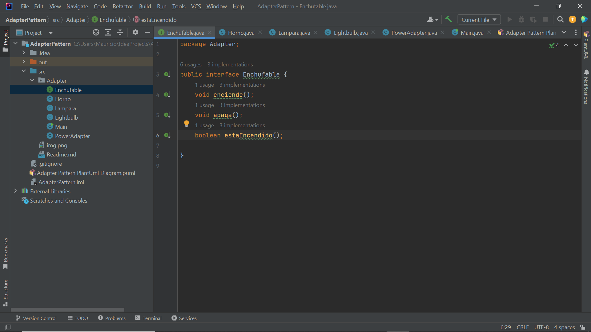
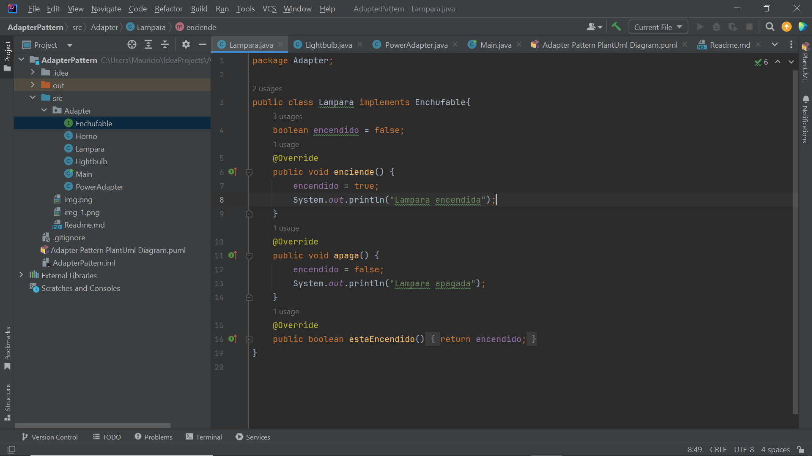
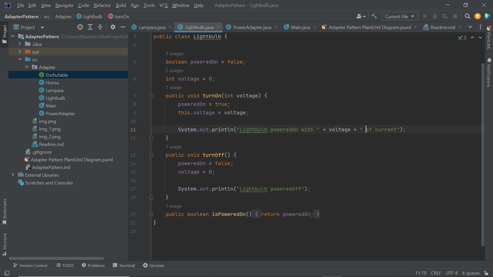
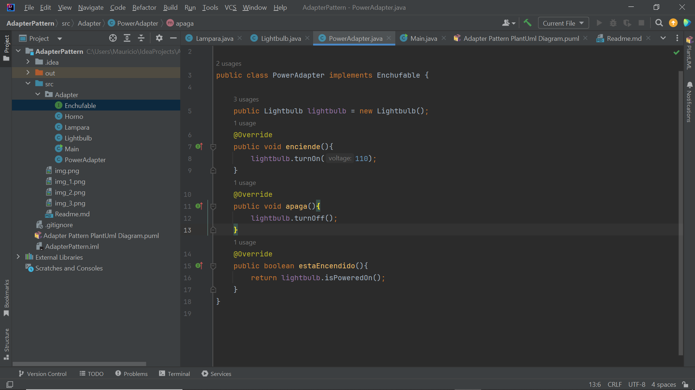
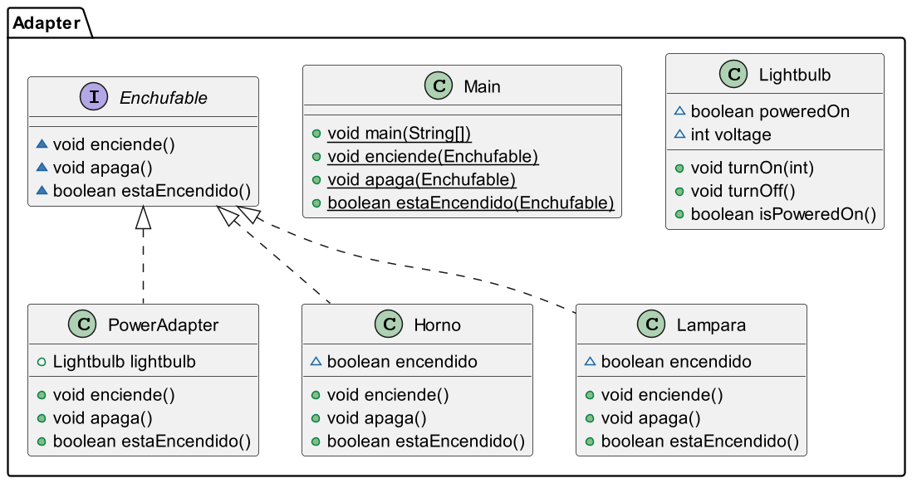
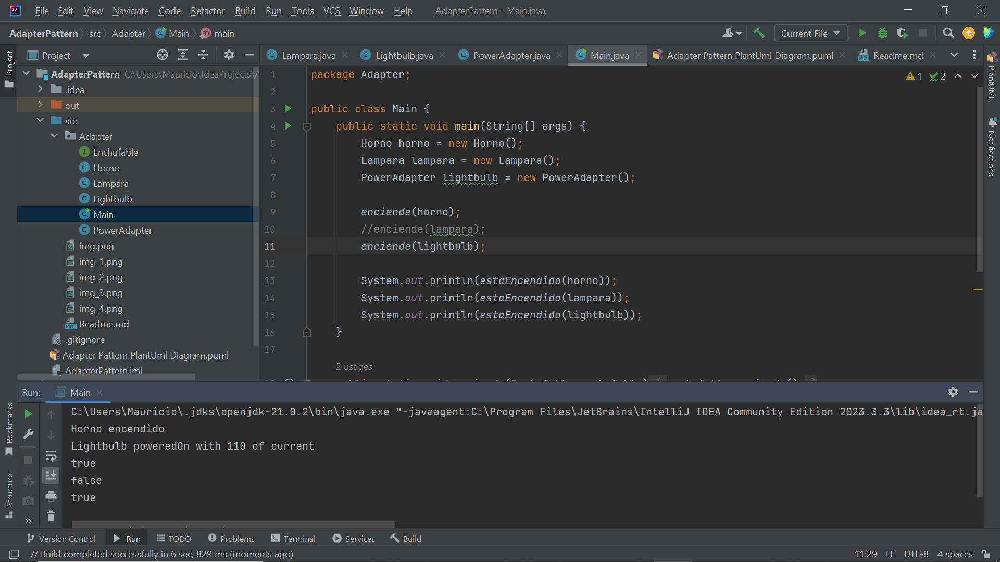

**Patrón de Diseño: Adaptador**

El patrón de diseño Adaptador, también conocido como Wrapper, es un patrón estructural que permite que interfaces incompatibles trabajen juntas. Este patrón actúa como un puente entre dos interfaces, haciendo que una clase existente funcione con otras clases sin necesidad de modificar su código fuente.

**Propósito**

El propósito principal del patrón Adaptador es permitir que clases con interfaces incompatibles cooperen entre sí. Esto es especialmente útil cuando se integra un componente o una librería de terceros en un sistema existente, ya que el adaptador convierte la interfaz de una clase en otra que el cliente espera.

**Ejemplo de Uso en Java**

Imaginemos que tenemos una clase que implementa una interfaz EnchufeEuropeo y otra clase que espera una interfaz EnchufeAmericano. Para que estas dos clases trabajen juntas, podemos crear un adaptador que convierta de EnchufeEuropeo a EnchufeAmericano.

**Beneficios**

Reutilización de código: Permite reutilizar clases existentes sin necesidad de modificar su código.
Flexibilidad: Facilita la integración de componentes con interfaces distintas.
Simplicidad: Reduce la complejidad al evitar cambios en el código fuente original.

**Consideraciones**

Sobrecarga: Puede introducir una sobrecarga adicional debido a la doble conversión de interfaces.
Compatibilidad: Es esencial asegurar que el adaptador se implemente correctamente para mantener la compatibilidad entre interfaces.

**Sintesis del proyecto actual:**

El patrón adaptador crea una Clase, que permite que clases con la misma implementación y clases con distinta implementación funcionen coherentemente.

Por tanto tenemos que una Clase adaptadora es una Clase intermedia que hace que múltiples Clases que no tengan porqué estar necesariamente implementada con los mismos métodos, pueda trabajar coherentemente.

Esto se utiliza muchísimo cuando estamos trabajando con código legacy es decir código heredado o código antiguo con librerías que no dispone código fuente y a la cual le estamos agregando cosas o funcionalidades nuevas o actuales. Es decir que esto nos permite adaptarla a nuestras necesidades sin modificar el código fuente.

Ahora bien, ésta interfaz vamos a decir que tiene 3 métodos: void enciende(); void apaga(); y boolean estaEncendido();

Esto lo podemos aplicar a cualquier cosa como un horno microondas, lavavajillas y todo lo que se quiera. Así que como esto lo podemos aplicar a muchas cosas, bien ahora aquí nos vamos a crear una nueva Clase horno que va a implementar nuestra interfaz enchufable:
Como nos podemos dar cuenta, aunque son similares en concepto, no tienen nada que ver con las implementaciones realizadas previamente en las Clases Horno y Lampara en cuyos métodos no tenemos parámetros como sí sucede en la Lightbulb la cual no tiene un método enciende pues ésta no esta implementando nuestra Interfaz, pero que cuenta con un método turnOn(int voltage) el cual requiere un voltaje como parámetro.
Para ello, nos creamos una nueva Clase que se llame PowerAdapter, y tenemos así que nuestro PowerAdapter que implementa el patrón adaptador va a implementar la Interfaz Enchufable pues vamos a cumplir con las interfaces adaptando algo que no cumple nuestra Interfaz algo que si la cumple.

Nos damos cuenta de la Adaptación que hemos hecho, hemos implementado a nuestra Interfaz, pero por debajo estamos llamando a los métodos de otra Clase que tiene una Implementación distinta, pues se llaman distinto los métodos, tiene distintos parámetros para que podamos utilizarlo de la forma en que lo haríamos normalmente.

La hemos envuelto en un Adaptador que vamos a instanciar y ahora voy a crear el envoltorio:
Nota: “Casi todos los Patrones de diseño tiene una especie de Envoltorio”.

Básicamente lo que ha hecho el Adaptador, es convertir las llamadas, que son diferentes a mi Interfaz, a mi propia Interfaz, pues si en el caso de la Interfaz se llama enciende() mientras que en el caso de lo que no cumple, es turnOn() bueno pues yo tengo que crearme el adaptador de forma que llamo al método correcto dentro de la Clase que quiero con los parámetros necesarios y cómo el PowerAdapter está implementando la Interfaz que yo quiero utilizar realmente la puedo utilizar ya tras instanciarla como parámetro en mi método.
Así hemos tomado, una Clase que no era compatible con nuestra Interfaz y sobre esa Clase hemos construido un Adaptador que implementa una Interfaz que si es compatible con lo que yo tengo, lo cual es súper habitual cuando estamos trabajando con librerías nuevas que tenemos que tenemos que adaptar librerías viejas a los cambios nuevos razón por lo cual es muy común utilizar el Patrón Adapter en los proyectos.

